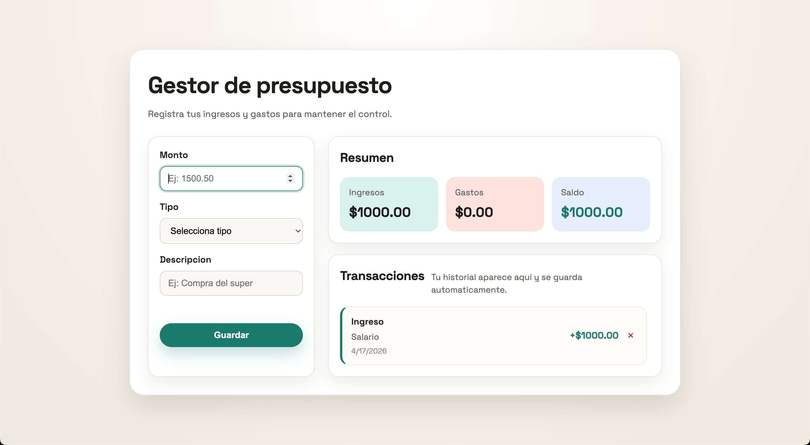

# Gestor de presupuesto

Aplicacion web para registrar ingresos y gastos, con resumen automatico y persistencia en el navegador.

## Funcionalidad

- Registrar transacciones con monto, tipo y descripcion.
- Calcular ingresos, gastos y saldo en tiempo real.
- Listar y eliminar transacciones con guardado en localStorage.

## Uso rapido

1. Abre [actividades/proyecto-u1-pag15/index.html](actividades/proyecto-u1-pag15/index.html) en tu navegador.
2. Completa el formulario y guarda la transaccion.
3. Verifica el resumen y la lista; recarga la pagina para confirmar persistencia.

## Autores

@estrellamd05-rgb
@cristianlorabeltre-design
@jyhro
