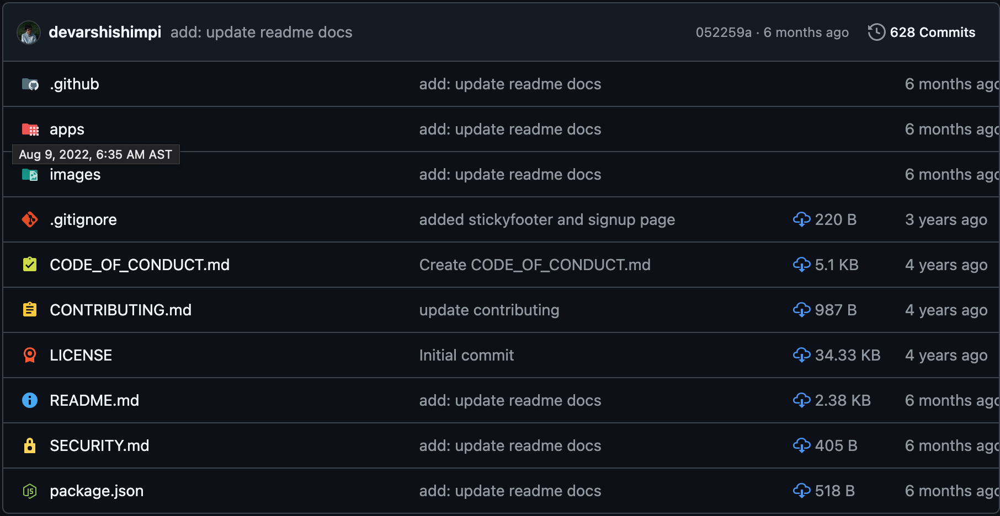

# Actividad 3 – Módulo 4: Uso Profesional de GitHub

## Fundamentación teórica

### ¿Qué es Git?

Git es un sistema de control de versiones que permite guardar el historial de cambios de un proyecto. Sirve para trabajar en equipo o de forma individual sin perder versiones anteriores del código.

**Ejemplo:**

Si estás creando una página web y cambias el diseño varias veces, Git te permite volver a una versión anterior si algo sale mal.

### ¿Qué es GitHub?

GitHub es una plataforma en la nube que permite almacenar repositorios Git y trabajar de forma colaborativa. Es como una _“red social de programadores”_.

**Ejemplo:**

Subir tu proyecto a GitHub para compartirlo con tu profesor o con tus compañeros.

### Diferencia entre repositorio local y remoto

- Repositorio local: Está en tu computadora. No necesita internet.
- Repositorio remoto: Está en la nube (GitHub, GitLab, etc.) y permite compartir el proyecto.

**Ejemplo:**

**Local:** una carpeta en Visual Studio o en tu PC.
**Remoto:** el proyecto subido a GitHub.

### Conceptos básicos de Git

- **Commit:** es un “guardado” de los cambios del proyecto.

**Ejemplo:**

Guardar cuando ya terminaste una parte del código.

- **Push:** es enviar los cambios del repositorio local al remoto (GitHub).

```bash
git push origin <Nombre de la rama>
```

**Ejemplo:**

Subir tu trabajo a GitHub después de hacer commits.

- **Pull:** es traer los cambios del repositorio remoto al local.

```bash
git pull
```

**Ejemplo:**

Descargar los cambios que hizo un compañero en el proyecto.

- **Branch (rama):** es una copia del proyecto en la que puedes trabajar sin afectar la versión principal.

```bash
git branch
```

**Ejemplo:**

Crear una rama para probar una nueva función sin dañar el proyecto principal.

- **Merge:** es unir dos ramas en una sola.

```bash
git merge
```

**Ejemplo:**

Agregar la nueva función de una rama al proyecto principal.

- **Fork:** es una copia del repositorio de otra persona en tu propia cuenta de GitHub.

**Ejemplo:**

Copiar un proyecto público para modificarlo sin afectar el original.

- **Pull Request:** es una solicitud para que los cambios de una rama o de un fork se integren al proyecto principal.

**Ejemplo:**

Proponer tus cambios al dueño del repositorio para que los revise y los acepte.

## Desarrollo de Actividades de Aprendizaje

### Actividad de Aprendizaje 1 - pag.19

**Nombre del proyecto**: Noteslify

**Descripción general**: Es una alternativa a EverNote, más segura y privada.

**Cómo se organiza el código**:

```text
Noteslify/
├── apps/
│   ├── mobile/
│   │   └── noteslify
│   └── web/
│       ├── backend/
│       ├── frontend/
│       ├── frontendnew/
│       └── docker-compose.yaml
├── images/
├── CODE_OF_CONDUCT.md
├── CONTRIBUTING.md
├── LICENSE
├── README.md
├── SECURITY.md
└── package.json
```

**Cómo se gestionan los cambios**: Con contribuciones, issues y pull requests. Las reglas las maneja en el archivo `CONTRIBUTING.md`.

**Qué tipo de comunidad participa**: Tanto del desarrollo web como de parte del movil.



## Desarrollo de Proyectos de Cierre

**Modelo de trabajo seleccionado:**
**Justificación de la elección:**
**Cómo se organizó el equipo:**
**Dificultades encontradas:**
**Aprendizajes obtenidos:**

### Reflexión

1. **¿Por qué el modelo elegido fue adecuado (o no)?**
    El modelo de forks en GitHub es ideal para un equipo de tres personas porque facilita un trabajo independiente y descentralizado, permitiendo que cada miembro desarrolle en su propio fork sin riesgo de sobrescribir cambios ajenos. Asi que si prodriamos decir que fue adecuado.

2. **¿Qué mejorarías en la organización del equipo?**
    En un proyecto real con equipos grandes, combinaría forks con ramas protegidas en el repositorio principal, algo que no hicimos, tambien estos:

    - **Forks para contribuidores externos:** Garantiza que usuarios ajenos al equipo puedan proponer cambios sin acceso directo.
    - **Ramas protegidas en el repositorio principal:** Mejora la eficiencia para equipos internos.
    - **Revisiones obligatorias:** Asegura control de calidad antes de integrar cambios.
    - **Comunicación clara:** Facilita la coordinación entre desarrolladores.
    - **Escalabilidad:** Permite crecer sin perder organización ni trazabilidad.

3. **¿Qué modelo utilizarías en un proyecto real?**
    Dependiendo de la cantidad de integrantes del equipo, el tipo de proyecto, entre otras variables, seria muy ambiguo. Pero me gusto trabajar con **Forks** mediante contribuciones.

## Proyecto Final del Módulo

### Resumen del Proyecto

**Repositorio:** [guia3](https://github.com/jyhro/guia3)
**Documentación:** [Docs](https://github.com/jyhro/guia3/blob/main/docs/README.md)
**Evidencias organizadas:**

```text
guia3/
├── actividades/
│   └── proyecto-u1-pag15/
│       ├── assets/
│       │   └── styles.css
│       ├── js/
│       │   └── app.js
│       └── index.html
├── ejemplos/
│   └── ejemplo-pag11/
│       └── yeiser.md
├── README.md
├── TODOs.md
└── preview.png
```

### Mis aportes

**@jyhro (Coordinador):** Como coordinador,cree las tareas/issues conceniente al proyecto y el desarrollo secuencial de ello.

**@estrellamd05-rgb (Desarrollador 1):** Fui la encargada de realizar las tareas propuestas por @jyhro, tanto del desarrollo de HTML y CSS de la web.

**@cristianlorabeltre-design (Desarrollador 2):** Como desarrollador tambien estuve realizando las tareas asignadas tanto de HTML como del JS.
